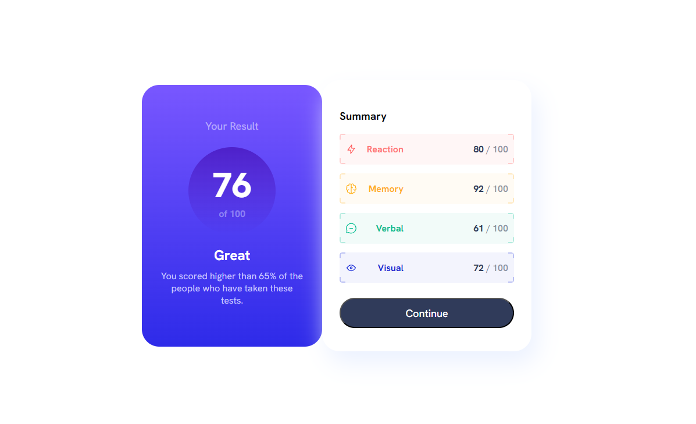

# Frontend Mentor - Results summary component solution

This is a solution to the [Results summary component challenge on Frontend Mentor](https://www.frontendmentor.io/challenges/results-summary-component-CE_K6s0maV). Frontend Mentor challenges help you improve your coding skills by building realistic projects. 

## Table of contents

- [Overview](#overview)
  - [The challenge](#the-challenge)
  - [Screenshot](#screenshot)
  - [Links](#links)
- [My process](#my-process)
  - [Built with](#built-with)
  - [What I learned](#what-i-learned)
  - [Continued development](#continued-development)
  - [Useful resources](#useful-resources)
- [Author](#author)

## Overview

### The challenge

Users should be able to:

- View the optimal layout for the interface depending on their device's screen size
- See hover and focus states for all interactive elements on the page
- **Bonus**: Use the local JSON data to dynamically populate the content

### Screenshot




### Links

- Solution URL: [Github Solution](https://github.com/Bkevin3110/learning-Results)
- Live Site URL: [Netlify Live Site](https://dynamic-unicorn-8b94b4.netlify.app/)

## My process

### Built with

- HTML
- CSS custom properties
- Flexbox
- Mobile-first workflow
- [Javascript](https://www.javascript.com/) - Javascript
- [jQuery](https://jquery.com/) - JQuery


### What I learned

Using a lot of online searching on how to do things to get an idea. This resulted in more DIVs then I thought i would be using.
Below for the category boxes in the summary. I didnt think i would need this many. Maybe I am overusing one or two but this is what I ended up with to get the  I needed.
```html
<div class="summary-rect" id="reaction">
      <div id="summary-reaction-border" class="border-position"></div>
      <div class="summary-content">
        <div class="summary-content-title">
        
        <span class="title" id="title-reaction"></span>
        </div>
        <span class="score"><span class="summary-score" id="reaction-score"></span> / 100</span>
      </div>
```

CSS wise I still need to clean it up. There is lots of redundent code in which I could just create a class and add it to the classes for the section.
This is my first time using fonts that I had downloaded. It wouldn't load for a long time until I figured out to put the '' in the right spots
```css
@font-face{
    font-family: 'HankenGrotesk';
    font-style: normal;
    font-weight: 700;
    src: url('./assets/fonts/static/HankenGrotesk-Bold.ttf') format('truetype');
}

@font-face{
    font-family: 'HankenGrotesk';
    font-style: normal;
    font-weight: 800;
    src: url('./assets/fonts/static/HankenGrotesk-ExtraBold.ttf') format('truetype');
}
@font-face{
    font-family: 'HankenGrotesk';
    font-style: normal;
    font-weight: 500;
    src: url('./assets/fonts/static/HankenGrotesk-Medium.ttf') format('truetype');
}

@font-face{
    font-family: 'HankenGroteskVF';
    src: url('./assets/fonts/HankenGrotesk-VariableFont_wght.ttf') format('truetype');
    font-weight: 100 1000;
    font-stretch: 75% 200%;
    font-variation-settings: 'wdth' 100, 'wght' 400;
}
```

Javascript I learned you can't locally load JSON data because of Browser Securitys.
You either had to load it onto a server or start a Local host server.
Ended up just uploading to Netlify a couple times as this was the last part of the project. Adding hover event and loading information from JSON to html
```js
$.getJSON("./data.json", function(jsonData){
    ....
}

```


### Continued development

Want to learn more on CSS Preprocessors like SASS
Develop more with Javascript.
Organize CSS better and put redundant classes together so I don't have to write the same lines again.

### Useful resources

These two examples below on How to get borders around my boxes and corners. I ended up with using example 2 as Example 1 had a lot more divs then I wanted. Then I would've had to make way more classes/ids in css for each box.
Example 2 I would've only had a section to work with but it wasn't as easy and flexible as example 1.
- [Example 1 Borders](https://stackoverflow.com/questions/75607228/how-can-you-apply-a-border-to-only-corners-of-a-container-in-css*/) 
- [Example 2 Borders](https://stackoverflow.com/questions/14387690/how-can-i-show-only-corner-borders) 


## Author

- GitHub - [Bkevin3110](https://github.com/Bkevin3110/)
- Frontend Mentor - [@Bkevin3110](https://www.frontendmentor.io/profile/Bkevin3110)


